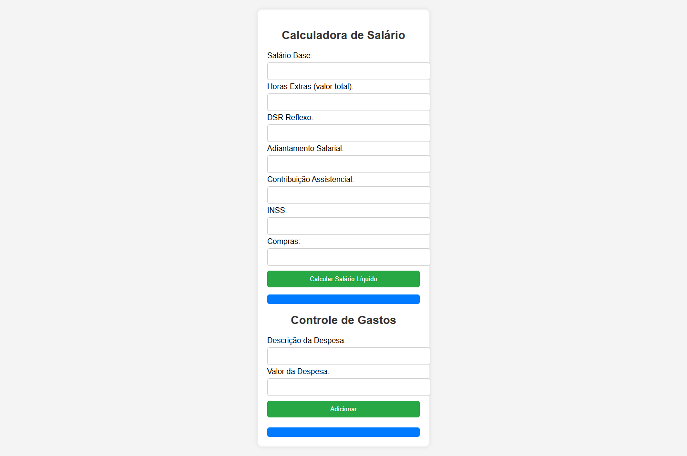

# Calculadora de Salário e Controle de Gastos

Este é um projeto simples desenvolvido com **HTML, CSS e JavaScript** que permite calcular o salário líquido a partir de informações como salário base, horas extras, descontos e contribuições. Além disso, oferece um controle de gastos mensal, onde é possível adicionar despesas e visualizar o saldo restante.

## 📌 Funcionalidades
- **Cálculo do salário líquido** com base nos valores fornecidos.
- **Conversão automática de valores** para aceitar números com `.` ou `,`.
- **Controle de gastos**, permitindo adicionar despesas com descrição e valor.
- **Atualização dinâmica do saldo** conforme novas despesas são inseridas.
- **Interface amigável**, responsiva e intuitiva.

## 🛠️ Tecnologias Utilizadas
- **HTML**: Estrutura da página.
- **CSS**: Estilização e design responsivo.
- **JavaScript**: Manipulação de dados e interatividade.

## 🚀 Como Usar
1. Clone este repositório:
   ```sh
   git clone https://github.com/seu-usuario/calculadora-salario.git
   ```
2. Abra o arquivo `index.html` no seu navegador.
3. Preencha os campos do salário e descontos.
4. Clique em "Calcular Salário Líquido" para obter o resultado.
5. Para adicionar despesas, insira a descrição e valor, depois clique em "Adicionar".
6. O saldo será atualizado automaticamente conforme os gastos são inseridos.

## 📷 Captura de Tela
> *(Adicione aqui uma imagem da interface do projeto)*
> 

## 📌 Melhorias Futuras
- Adicionar armazenamento local para salvar os dados.
- Criar um backend para persistência de informações.
- Melhorar o design e experiência do usuário.

## 📝 Licença
Este projeto é de código aberto e está licenciado sob a **MIT License**.

---

💡 **Sinta-se à vontade para contribuir, abrir issues ou sugerir melhorias!**

